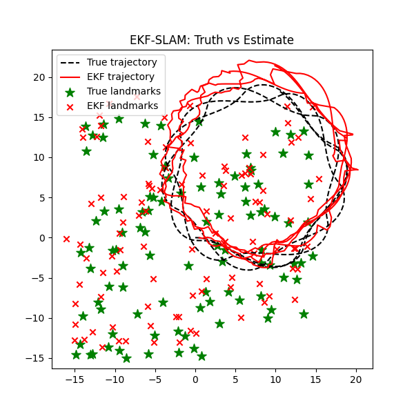

# EKF-SLAM From Scratch (C++ / Eigen)

This repository contains a **complete Extended Kalman Filter SLAM (EKF-SLAM) system implemented entirely from first principles**, including:

- Motion and measurement models
- Full Jacobian derivations (prediction and update)
- Kalman filter prediction and correction steps
- Online landmark initialization and state augmentation
- A custom simulation environment for validation
- Visualization of results

**Important**:  
This project was written **entirely by me, from scratch**.  
No SLAM libraries, EKF libraries, robotics frameworks, or third-party filtering code were used.  
All mathematics, linearization, matrix construction, and system logic were derived, implemented, and debugged manually.

The goal of this project was **deep understanding**, not speed or abstraction.

---

## What This Project Does

The system jointly estimates:

- The **robot pose**  
  \[
  x_r = [x, y, theta]
  \]

- The positions of an **unknown and dynamically growing set of landmarks**  
  \[
  x_l_i = [l_x_i, l_y_i]
  \]

The full EKF-SLAM state vector has the pose followed by the landmarks in one large vector

The covariance matrix grows consistently as new landmarks are discovered.

---

## Results


*Figure: EKF-SLAM trajectory estimation showing the true path, estimated path, and detected landmarks.*

A **figure showing the EKF trajectory, true trajectory, and landmarks is included** in this repository.

---

## EKF-SLAM Implementation Details

### Prediction Step

- Uses a **nonlinear unicycle motion model**
- Handles both straight-line and rotational motion
- Orientation is explicitly normalized to \([-π, π]\)
- The Jacobian \(F\) is constructed manually and applied only to the robot pose block
- Landmarks are unaffected during prediction (physically correct)

Motion noise is injected based on:
- Linear velocity
- Angular velocity
- Time step duration

---

### Update Step

- Measurements consist of **range and bearing**
- Predicted measurements are computed in measurement space
- Residuals are angle-wrapped to prevent discontinuities
- The measurement Jacobian \(H\) is derived **by hand**, with:
  - Correct sign structure
  - Zero influence on unrelated landmarks
  - Explicit dependence on robot pose and the observed landmark only

Kalman gain computation balances:
- State uncertainty
- Measurement uncertainty
- Geometric observability

---

### Landmark Initialization

- Landmarks are added **online**, at first observation
- The state vector and covariance matrix are resized dynamically
- Initial landmark positions are computed in global coordinates
- Cross-covariances are carefully zeroed to avoid artificial correlations

---

## Simulation Environment

The EKF-SLAM system is validated using a fully controlled simulation:

- Ground-truth robot motion (unicycle model)
- Noisy control inputs
- Limited sensor range and field of view
- Independent Gaussian noise on range and bearing
- Known ground-truth landmarks (for evaluation only)

This ensures the filter is tested under **realistic partial observability conditions**.

---

## Build & Run (macOS)

This project was compiled and run on **macOS** using **g++** and **Eigen**.

### Build Command

```bash
g++ -std=c++17 -Wall -Wextra -Wpedantic \
    -I /opt/homebrew/include/eigen3 \
    main.cpp ekf_slam.cpp sim.cpp \
    -o ekf_slam


